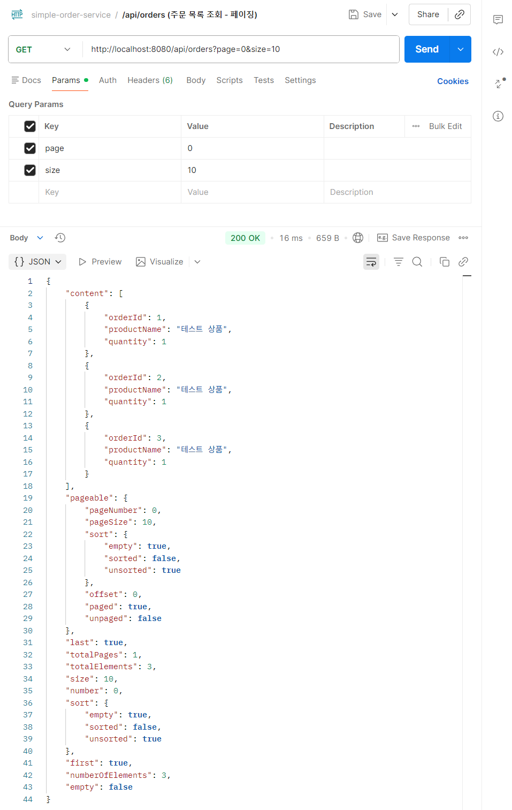
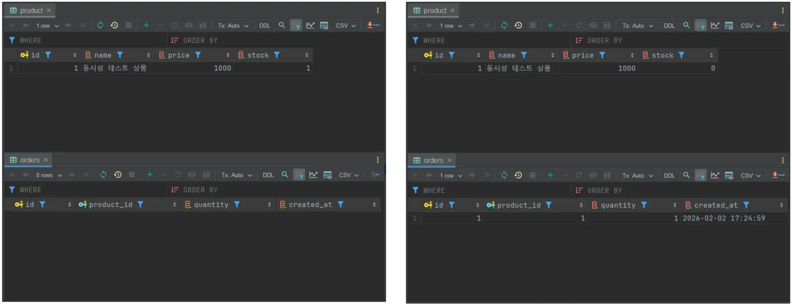

# Simple Order Service

Spring Boot 기반의 주문 관리 미니 프로젝트입니다.  
상품(Product)과 주문(Order) 도메인을 중심으로  
기본적인 CRUD 기능과 트랜잭션 단위 주문 처리 로직을 구현했습니다.

---

## 📌 프로젝트 개요

- 상품(Product) / 주문(Order) 도메인 기반 CRUD 구현
- Spring Data JPA를 활용한 데이터 접근
- 주문 생성 시 재고 차감 로직 포함
- 트랜잭션 단위로 주문 처리 흐름 설계

---

## ✨ 핵심 기능

- 상품(Product) 등록 / 조회 / 수정 / 삭제
- 주문(Order) 생성 및 조회
- 주문 생성 시 상품 재고 차감 처리
- 상품 삭제 시 soft delete 방식 적용
- JPA 기반 연관관계 매핑 및 트랜잭션 관리

---

## 🧠 설계 포인트

### 1️⃣ 주문 생성 트랜잭션 처리
주문 생성 과정에서  
**상품 조회 → 재고 차감 → 주문 생성 → 저장**  
의 흐름을 하나의 트랜잭션으로 처리했습니다.

이를 통해 중간 단계에서 오류가 발생할 경우  
데이터 정합성이 깨지지 않도록 설계했습니다.

---

### 2️⃣ 상품 삭제 방식 (Soft Delete)
상품을 실제로 삭제하는 대신 **soft delete 방식**을 적용했습니다.

- 기존 주문 이력과의 데이터 무결성 유지
- 삭제된 상품이 주문 데이터에 영향을 주지 않도록 설계

---

## 🧪 주문 목록 조회 실행 결과

주문 목록 조회 API를 실행한 결과입니다.  
페이징 처리된 주문 목록과 함께 각 주문에 대한 상품 정보가 정상적으로 조회됩니다.

<p align="center">
  

</p>

### 🔍 N+1 문제 처리
주문 목록 조회 시 연관된 상품 정보를 fetch join으로 함께 조회하여  
주문 수만큼 추가 쿼리가 발생하는 N+1 문제를 방지했습니다.

---

## 🧪 재고 1인 상품 주문 테스트

재고가 1인 상품에 대해 주문을 2회 시도했습니다.  
첫 번째 주문은 성공하여 주문이 생성되고 재고가 1 → 0으로 감소했으며,  
두 번째 주문은 재고 부족으로 인해 실패하여 추가 주문이 생성되지 않았습니다.

아래는 주문 처리 전/후의 데이터베이스 상태를 비교한 결과입니다.

<p align="center">
  
</p>

---

### 🔐 재고 차감 원자성 확보 방법

재고 차감 로직에서 상품 조회 시 비관적 락(PESSIMISTIC WRITE)을 적용하여  
동시에 여러 주문 요청이 발생하더라도 하나의 트랜잭션만 재고를 차감하도록 처리했습니다.  
이를 통해 재고 중복 차감 및 데드락 상황을 방지했습니다.

## 📄 API 요약

주요 기능에 대한 API 엔드포인트를 요약했습니다.

| Method | URL | 설명 |
|------|-----|------|
| GET | /api/products | 상품 목록 조회 |
| GET | /api/products/{id} | 상품 단건 조회 |
| POST | /api/products | 상품 등록 |
| PATCH | /api/products/{id} | 상품 수정 |
| DELETE | /api/products/{id} | 상품 삭제 |
| POST | /api/orders | 주문 생성 |
| GET | /api/orders | 주문 목록 조회 |

---

## ▶️ 실행 방법

```bash
./gradlew bootRun
```

---

## 🛠️ 기술 스택

- Java 17
- Spring Boot
- Spring Data JPA
- H2 / MySQL
- Gradle

---

## 📌 정리

본 프로젝트는 주문 처리의 기본적인 흐름과
트랜잭션 관리, 도메인 설계에 집중한 미니 프로젝트입니다.